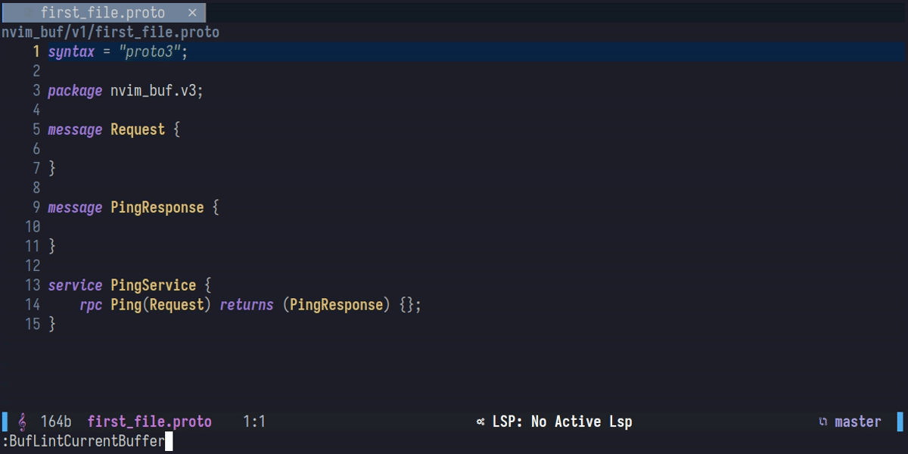

# Nvim Buf Lint



## Goals 🏃

- Are you a developer that's actively working with Protobuf?
- Are you using [buf cli](https://buf.build/product/cli/) to simplify your workflow with Protobuf?
- AND, are you a neovim user?

Then, this plugin is a perfect addition to your neovim experience when dealing with Google's Protobuf!
This plugin, while simple, provides a way for [buf cli](https://buf.build/product/cli/) to interact with `vim.diagnostic` framework, enriching your development experience in dealing with Protobuf by providing linting error messages!.

## The Idea Behind This Plugin

- I just noticed that `buf lint` has an option `--error-format` which can spit out JSON formatted linting errors! 🤔
- I thought to myself, well this can work well with Neovim diagnostic framework then. And I immediately started prototyping this plugin, and completed a simple linter integration on that day.
- If there are any suggestions, you're welcome to put up issues / pull requests! I'm really new to neovim plugin development at the moment, so I will appreciate any help you guys give to by contributing to this project. 🙇

## Installation 📦

- Requires Neovim > `0.6.0` (which was the time `vim.diagnostic` framework was introduced)
- **Packer**

```lua
require("packer").startup(function(use)
    use({ "yeyee2901/nvim-buf-lint" })
end)
```

## Setup 🔧

```lua
require("nvim-buf-lint").init()
```

You may also pass a table of options.

```lua
require("nvim-buf-lint").init{
    -- some options ...
}
```

The `init()` function accepts these option parameters:

- `exe_path` : The **full path** to `buf` executable (defaults to `"buf"`, or in otherwords system wide installation taken from your $PATH)

## Usage 🔎

- Go to any of your Protobuf project.
- Open neovim from the root directory of the project (the root directory is the directory containing `buf.yaml` file)
- Go to any of your proto files
- Run `lua require("nvim-buf-lint").lint()` or you can run the provided user command `:BufLintCurrentBuffer`

## Current Limitations

- The linter will only run on command invocation

## Roadmap 🚀

- ✅ Simple linting
-  Toggle lint on save option
-  Integrate with quickfix
-  Inject diagnostic error message in all buffer (?)
-  Integrate with `telescope.nvim` !
